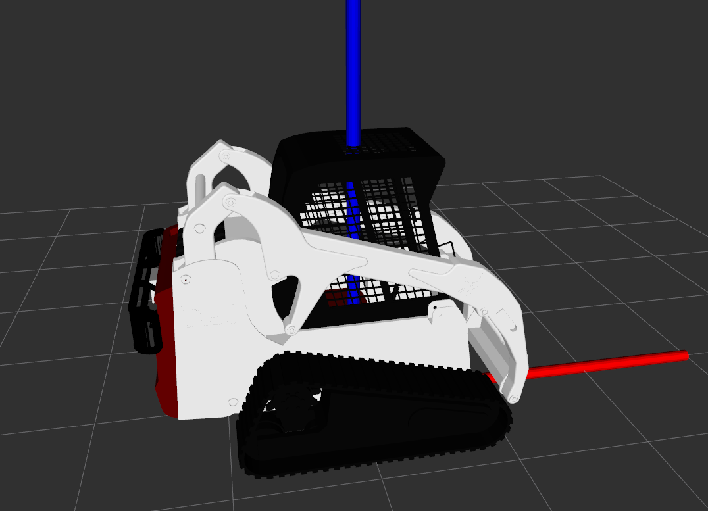

# semfire_dataset_ntu: pkg for running the dataset with the SEMFIRE instrumented bobcat

### v0.1 (David Portugal)
ROS pkg for running the SEMFIRE Dataset and visualization.

Tested on Ubuntu 18.04 and ROS Melodic

David Portugal (June 29, 2020)

## Compiling

```
cd your_work_space
catkin_make 
```

## Usage

```
roslaunch semfire_dataset_ntu run_dataset.launch
```

